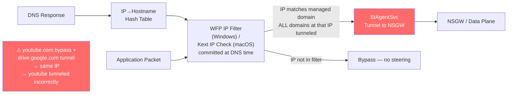
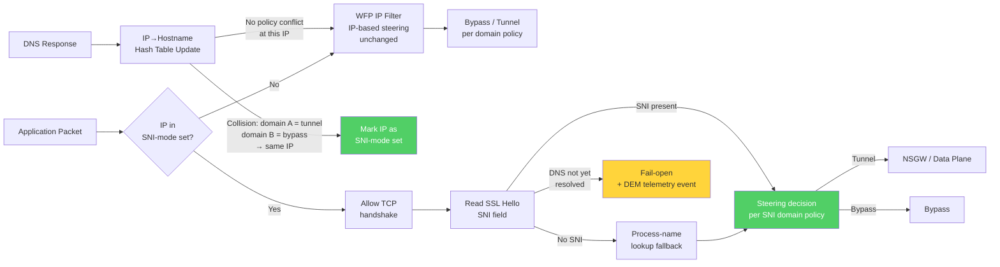

# Delivery Spec: Remove Overlapping Domain Constraint in Netskope Client Steering

**Source:** PRD NPLAN-7844
**Generated:** 2026-06-18 (PM Draft; Engineering co-authoring pending)
**Status:** PM Draft — NS Client Engineering to co-author and close OPEN blocking unknowns
**Jira:** [NPLAN-7844](https://netskope.atlassian.net/browse/NPLAN-7844)

> **Co-authoring note.** This spec is the PM's first draft based on the approved PRD. NS Client Engineering leads must own: (a) BU-1 — platform-specific SNI interception mechanisms for Android, iOS, and Linux; (b) BU-2 — process-name lookup reliability on mobile platforms; (c) BU-3 — migration strategy for changing `clientHandleOverlappingDomains` default; (d) BU-4 — AppDB `domain_overlapping` table disposition. PM-proposed values appear inline as recommendations; they are not binding until Eng sign-off.

| Version | Date | Author | Changes |
|---------|------|--------|---------|
| 0.1 | 2026-06-18 | Phanikumar Dharmavarapu | Initial PM draft |

---

## Architecture Overview

### Current State

The Netskope Client kernel driver intercepts DNS responses to build an IP→Hostname hash table. Steering decisions are **committed at DNS response time** — before any application traffic flows. When two domains with differing bypass/tunnel policies resolve to the same IP, the WFP IP filter (Windows) or kernel extension IP check (macOS) applies to both indiscriminately. Bypass-configured traffic is incorrectly tunneled.

**Current workaround:** Eng manually curates overlapping domain sets in the AppDB `domain_overlapping` table → provisioner pushes `nsoverlap.json` to the client → tenant-level flag `clientHandleOverlappingDomains=1` enables SNI-based steering for those sets only. Reactive, per-tenant, requires Eng escalation.

### Target State

The kernel driver detects IP collisions in the DNS hash table automatically. When a collision is detected between domains with differing policies, the client switches to SNI-based steering for that conflict set — deferring the tunnel/bypass decision until the SSL Hello is received. Non-SNI traffic falls back to process-name lookup. DNS timing races fail open with a DEM telemetry event.

### Component Changes

| Component | State | Modified / New? | Owning Team |
|-----------|-------|-----------------|-------------|
| Kernel driver — Windows (WFP) | Adds policy-conflict detection on DNS hash table update; marks conflicted IPs as SNI-mode | Modified | NS Client |
| Kernel driver — macOS (kext/sysext) | Same collision detection logic as Windows; kext-specific implementation | Modified | NS Client |
| Kernel driver — Android | Collision detection via platform VPN/DNS interception API (pending BU-1) | Modified | NS Client |
| Kernel driver — iOS | Collision detection via Network Extension framework (pending BU-1) | Modified | NS Client |
| Kernel driver — Linux | Collision detection via netfilter or equivalent (pending BU-1) | Modified | NS Client |
| StAgentSvc | SNI-mode steering path: allows TCP handshake, reads SSL Hello SNI, applies domain policy; integrates process-name lookup fallback | Modified | NS Client |
| Provisioner | Changes `clientHandleOverlappingDomains` default to always-on; migration strategy per BU-3 | Modified | NS Client / Provisioner |
| AppDB `domain_overlapping` table | Retained as explicit override for edge cases; auto-detection supplements (not replaces) it. Disposition per BU-4 | Modified | NS Client / App DB |
| DEM telemetry event stream | New event type: `steering_failopen_dns_unresolved` (timestamp, platform, source IP) | Modified | NS Client / DEM |
| `nsoverlap.json` | May be repurposed as auto-detection cache output (pending BU-4); existing entries honored as override | Modified | NS Client |
| NSGW / Data Plane | Unchanged — receives the same SPDY-framed tunnel traffic regardless of how steering decision was made | Unchanged | N/A |
| NSProxy | Unchanged | Unchanged | N/A |
| Admin Console UI | Unchanged — no new UI at Phase 1 (admin toggle deferred to post-GA) | Unchanged | N/A |

### Architectural Guidance

**Do not break IP-based steering for non-conflicting IPs.** The SNI-mode path must only activate for IPs where a confirmed policy conflict exists in the DNS hash table. IPs with a single domain or with all-same-policy domains must continue using the faster IP-based path. Switching all traffic to SNI-mode globally would introduce unnecessary latency and is explicitly out of scope.

**Collision detection is policy-aware, not domain-count-aware.** An IP shared by `drive.google.com` (tunnel) and `youtube.com` (bypass) is a conflict. An IP shared by `drive.google.com` and `docs.google.com` (both tunnel) is NOT a conflict. The detection logic must compare bypass/tunnel policy assignment, not merely count domains per IP.

**Backward compatibility is a hard constraint.** Tenants with existing `clientHandleOverlappingDomains=1` and explicit `nsoverlap.json` must not experience behavior changes. The explicit list must be honored as an override even when auto-detection produces a different set. Do not deprecate the existing mechanism without a separate migration NPLAN and tenant communication.

**Fail-open is correct behavior for DNS timing races.** When a packet arrives before DNS has resolved, the correct behavior is to pass the packet without steering and emit a DEM telemetry event. Do not fail-closed (block) on unresolved DNS — this would break legitimate traffic and is inconsistent with the existing fail-open model for tunnel-unavailable scenarios.

---

## Scenarios with Acceptance Criteria

### SC-1: Auto-detect overlapping domain sets

**Given** the Netskope Client is running and has a DNS hash table entry for IP `X.X.X.X` mapped to domain `A` (policy: tunnel),
**When** a DNS response arrives mapping domain `B` (policy: bypass) to the same IP `X.X.X.X`,
**Then** the client automatically marks `X.X.X.X` as an SNI-mode IP without requiring any AppDB entry, provisioner API call, or tenant flag change.

**Given** the same IP `X.X.X.X` is shared by domain `C` (policy: tunnel) and domain `D` (policy: tunnel),
**When** the DNS hash table is updated,
**Then** the IP is NOT marked as SNI-mode (same policy — no conflict).

**Acceptance criteria:**
- Collision detection fires within one DNS response processing cycle (no deferred or scheduled scan).
- The SNI-mode marking is in-memory and does not require a config file write or provisioner round-trip.
- Collision detection produces correct results for all combinations: (tunnel+bypass), (bypass+bypass), (tunnel+tunnel) — only tunnel+bypass (or bypass+tunnel) triggers SNI mode.
- Existing `nsoverlap.json` entries continue to trigger SNI mode regardless of whether auto-detection also fires for the same IP.
- Performance: DNS hash table update latency increases by ≤ 1 ms P95 under a representative load of 1,000 DNS responses/minute. (pending BU-3 performance benchmark target)

### SC-2: SNI-based bypass decision — CASB mode

**Given** the client is in CASB mode, domain `A` is configured as tunnel, domain `B` is configured as bypass, both resolve to IP `X.X.X.X`, and `X.X.X.X` is marked as SNI-mode,
**When** an application initiates an SSL connection to `X.X.X.X`,
**Then** the client allows the TCP handshake to complete, reads the SNI from the SSL Hello, and applies the correct policy: tunnel for domain `A`, bypass for domain `B`.

**Given** the same SNI-mode IP and a connection where the SNI identifies domain `A` (tunnel),
**When** the SSL Hello is received,
**Then** the connection is tunneled to NSGW and the SPDY frame includes the correct hostname from the SNI field.

**Acceptance criteria:**
- Bypass-configured domains at a conflicting IP are never tunneled when SNI is present and identifies the bypass domain.
- Tunnel-configured domains at a conflicting IP are always tunneled when SNI is present and identifies the tunnel domain.
- SNI-based steering decision latency (from TCP SYN to steering decision) is ≤ 200 ms P95 on a representative 100 Mbps client connection.
- No RST packet is sent to the destination server before the TCP handshake completes.
- Tested with known overlapping sets: Google CDN domains (youtube.com / drive.google.com), Akamai CDN domains.

### SC-3: SNI-based bypass decision — Web mode

**Given** the client is in Web mode (all HTTP/HTTPS tunneled by default), domain `B` is explicitly configured as bypass in the exception list, both domain `A` and `B` resolve to the same IP, and the IP is marked as SNI-mode,
**When** an application initiates an SSL connection to that IP,
**Then** the bypass exception for domain `B` is respected — traffic for `B` is bypassed; all other traffic to that IP is tunneled per Web mode default.

**Given** Web mode with no bypass exception for domain `B`,
**When** an SSL connection is made to an SNI-mode IP,
**Then** the connection is tunneled (Web mode default behavior unchanged — SNI-mode only affects bypass decisions, not the all-tunnel default).

**Acceptance criteria:**
- Web mode all-traffic-tunnel behavior is preserved for domains without bypass exceptions, even when the IP is marked SNI-mode.
- Bypass exceptions in Web mode are correctly honored for overlapping IPs when SNI identifies the bypass domain.
- Regression: existing Web mode bypass exceptions for non-overlapping domains continue to function correctly (no side effects from the SNI-mode path).

### SC-4: Process-name lookup fallback for non-SNI native apps

**Given** the client is in CASB or Web mode, an IP is marked as SNI-mode, and a native application initiates an SSL connection without sending SNI in the ClientHello,
**When** the SSL Hello is inspected and no SNI field is found,
**Then** the client invokes process-name lookup to identify the application and applies the domain policy mapped to that process.

**Given** process-name lookup succeeds and identifies process `P` mapped to domain `B` (bypass),
**When** the client applies steering,
**Then** the connection is bypassed correctly.

**Given** process-name lookup fails (process cannot be identified),
**When** the client must make a steering decision,
**Then** the client fails open (passes traffic without steering) and emits a DEM telemetry event `steering_failopen_no_sni_no_process`.

**Acceptance criteria:**
- Process-name lookup is invoked only when SNI is absent from the SSL Hello — it does not fire for connections where SNI is present.
- Process-name lookup completes within 50 ms P95 on Windows and macOS.
- Process-name lookup behavior on Android and iOS defined by Eng per BU-2 resolution.
- Fail-open on lookup failure emits the correct DEM event within one processing cycle.

### SC-5: Fail-open with DEM telemetry on DNS timing race

**Given** a packet arrives for IP `X.X.X.X` before the DNS response mapping a domain to that IP has been processed by the hash table,
**When** the client must make a steering decision,
**Then** the packet is passed without steering (fail-open) and a `steering_failopen_dns_unresolved` DEM telemetry event is emitted containing: timestamp (UTC), platform, source IP (hashed), and event type.

**Given** the DNS response subsequently arrives and the IP is marked as SNI-mode,
**When** the next connection to that IP is initiated,
**Then** SNI-based steering is applied correctly for all subsequent connections.

**Acceptance criteria:**
- Fail-open behavior does not block or drop traffic — the packet must be delivered to the destination.
- DEM telemetry event is emitted within 500 ms of the fail-open decision.
- DEM event schema: `{ event_type: "steering_failopen_dns_unresolved", timestamp: ISO8601, platform: enum[windows|macos|android|ios|linux], source_ip_hash: sha256 }` — no domain names or user identity in the event payload.
- The fail-open path does not disable or reset the SNI-mode state for the IP — subsequent connections use SNI-based steering once DNS resolves.

### SC-6: All-platform support

**Given** the Netskope Client is installed on any of the five supported platforms (Windows, macOS, Android, iOS, Linux),
**When** an overlapping domain conflict is encountered,
**Then** auto-detection (SC-1), SNI-based steering (SC-2/SC-3), process-name lookup fallback (SC-4), and fail-open (SC-5) all behave correctly on that platform.

**Given** the client is on a platform where SNI interception at the required layer is not available (per BU-1 investigation),
**When** an overlapping domain conflict is encountered,
**Then** the client falls back to the existing IP-based steering behavior (no regression from current state) and the limitation is documented in platform release notes.

**Acceptance criteria:**
- SC-1 through SC-5 pass on Windows and macOS before Beta entry.
- SC-1 through SC-5 pass on Android, iOS, and Linux before GA (timeline per BU-1 resolution).
- No platform exhibits a P0/P1 regression in existing bypass, exception, or tunnel behavior attributable to this change.
- Platform-specific behavior differences (if any, per BU-1/BU-2) are explicitly documented in the Delivery Spec update at Design gate.

### SC-7: Backward compatibility with existing `clientHandleOverlappingDomains=1` tenants

**Given** a tenant has `clientHandleOverlappingDomains=1` explicitly set and a populated `nsoverlap.json` with manually curated domain sets,
**When** the new auto-detection behavior ships,
**Then** the explicit `nsoverlap.json` domain sets continue to trigger SNI-based steering, and the tenant's existing behavior is unchanged.

**Given** a tenant has `clientHandleOverlappingDomains=0` explicitly set (opted out),
**When** the new auto-detection default ships,
**Then** the explicit opt-out is honored per BU-3 migration strategy — the tenant is not silently opted into auto-detection.

**Acceptance criteria:**
- Existing tenants with `nsoverlap.json` entries do not experience any change in steering behavior for those domain sets.
- Tenants with `clientHandleOverlappingDomains=0` are not silently changed to always-on without a migration path defined in BU-3.
- QA regression test confirms no behavioral change for a synthetic tenant configured with the current workaround.

---

## Edge Cases and Failure Behavior

| Scenario | Expected Behavior | Detection |
|----------|-------------------|-----------|
| NSGW tunnel down while SNI-mode connection is in progress | Connection fails per existing tunnel-down behavior (fail-open or fail-closed per tenant config). SNI-mode state for the IP is preserved — no reset. | Existing DEM tunnel-down telemetry |
| SSL Hello never arrives (native app stalls after TCP handshake) | Client times out the SNI read after [Eng to define — recommended: 5 s] and fails open. DEM `steering_failopen_sni_timeout` event emitted. | DEM telemetry event |
| DNS response updates IP mapping (IP previously mapped to domain A now maps to domain B only) | Hash table updated; if conflict is removed (only one policy remains), IP is removed from SNI-mode set and reverts to IP-based steering. | No event (normal operation) |
| Tenant disables `clientHandleOverlappingDomains` via provisioner API | Explicit flag-off overrides auto-detection. Client reverts to pure IP-based steering. All SNI-mode markings cleared on next config refresh. | Provisioner API response |
| Overlapping IP affects NPA Private Access traffic | NPA traffic uses a separate tunnel path (per existing architecture). Overlapping domain detection applies to CASB and Web mode only. NPA behavior unchanged. | QA regression test |
| Process-name lookup returns a process not in the domain→process map | Fail-open. DEM `steering_failopen_no_sni_no_process` event emitted. Process→domain map updated asynchronously if new process is observed. | DEM telemetry event |
| Existing `nsoverlap.json` entry conflicts with auto-detected set | Explicit `nsoverlap.json` entry takes precedence. Auto-detection supplements but does not override. | QA validation test |
| Client restarts while SNI-mode IPs are in memory | SNI-mode state is rebuilt from DNS hash table on restart (DNS responses re-intercepted). No persistent state required. | Expected behavior — no special detection |
| Large number of conflicting IPs (>100 SNI-mode IPs simultaneously) | Performance must not degrade beyond SC-1 latency budget. No limit enforced on number of SNI-mode IPs. | Stress test in QA |

---

## Permissions / RBAC

No new permissions. Overlapping domain auto-detection is a client-side behavior change with no Admin Console UI at Phase 1. Management of `clientHandleOverlappingDomains` continues to use the existing provisioner API under the existing **Client Configuration** admin permission set.

---

## Telemetry and Observability

### Metrics

| Metric | Source | Priority |
|--------|--------|----------|
| `client.snimmode.active_ips` — count of IPs currently marked SNI-mode per client | StAgentSvc | P0 (Beta) |
| `client.snimode.decisions_total` — count of SNI-based steering decisions (tunnel vs bypass) | StAgentSvc | P0 (Beta) |
| `client.snimode.failopen_dns` — count of fail-open events (DNS unresolved) | StAgentSvc | P0 (Beta) |
| `client.snimode.failopen_nosni` — count of fail-open events (no SNI, no process match) | StAgentSvc | P0 (Beta) |
| `client.snimode.process_lookup_latency_p95_ms` — P95 latency of process-name lookup | StAgentSvc | P1 (GA) |
| `client.snimode.sni_read_latency_p95_ms` — P95 latency from TCP SYN to SNI-based decision | StAgentSvc | P1 (GA) |
| `client.snimode.collision_detections_total` — count of DNS hash table collisions detected | Kernel driver | P1 (GA) |

**Label hygiene note:** Do not use `source_ip` or `domain_name` as metric labels (unbounded cardinality). These are event fields in DEM telemetry, not metric labels.

### DEM Network Event Fields

| Field | Description | Events |
|-------|-------------|--------|
| `steering_mode` | `ip_based` or `sni_based` — which path made the decision | All steering events |
| `sni_present` | Boolean — whether SNI was found in the SSL Hello | SNI-mode events |
| `process_lookup_used` | Boolean — whether process-name lookup was invoked | SNI-mode events |
| `failopen_reason` | Enum: `dns_unresolved`, `sni_timeout`, `no_sni_no_process` | Fail-open events only |
| `source_ip_hash` | SHA-256 of client source IP — for correlation without PII | Fail-open events only |

---

## Implementation Approach (PM Recommendation; Eng to Validate)

### Critical Path

**BU-1 and BU-3 resolution (NS Client Eng + Provisioner) — Sprint 1. Blocks all other tracks.** BU-1 determines whether all-platform Phase 1 is feasible or must be descoped to Windows+macOS first. BU-3 determines the migration strategy that gates Provisioner changes. Neither can be deferred past Sprint 1 without scope revision.

### Parallel Tracks

**Track A — NS Client (Kernel driver + StAgentSvc):**
1. Sprint 1: BU-1 investigation (Android/iOS/Linux SNI interception). BU-2 investigation (mobile process-name lookup). Collision detection logic design for Windows + macOS.
2. Sprint 2: Implement collision detection in Windows WFP driver. Implement SNI-mode steering path in StAgentSvc. Unit tests for SC-1 and SC-2.
3. Sprint 3: Implement macOS kext/sysext equivalent. Process-name lookup integration (SC-4). Fail-open path + DEM event (SC-5). Unit tests for SC-3, SC-4, SC-5.
4. Sprint 4: Android + iOS + Linux implementations (if BU-1 confirms feasibility). SC-6 cross-platform QA. SC-7 backward compatibility regression.
5. Sprint 5: Beta build. Beta telemetry validation. Performance benchmarks (SC-1 latency, SC-2 latency).

**Track B — Provisioner:**
1. Sprint 1: BU-3 migration strategy design (staged vs. immediate default-on).
2. Sprint 2-3: Implement migration logic. Update `clientHandleOverlappingDomains` default handling.
3. Sprint 4: Integration test with Track A build.

**Track C — DEM:**
1. Sprint 2: Define and implement `steering_failopen_dns_unresolved` and `steering_failopen_no_sni_no_process` event types in DEM event stream.
2. Sprint 3: Validate events appear in DEM dashboard on test client.

### Phased Rollout

| Phase | Scope | Entry Criteria | Exit Criteria | Status |
|-------|-------|----------------|---------------|--------|
| Alpha | Internal Netskope dogfood (Netskope corporate fleet) | SC-1, SC-2, SC-3, SC-7 passing on Windows + macOS; DEM events visible | No P0/P1 regressions after 2 weeks dogfood; fail-open rate < 1% of steering decisions | Not started |
| Beta | Concentrix + newly onboarded tenant (NPLAN-7844 Jira) | Alpha exit criteria met; beta customers signed up; SC-4 (process-name lookup) passing | Zero overlapping-domain escalations from beta customers; DEM telemetry confirms correct steering in production | Not started |
| GA-Controlled | All tenants opt-in via Provisioner (staged per BU-3 migration plan) | Beta exit criteria met; SIA ticket closed; all platforms passing (per BU-1 scope) | No P0/P1 regressions in 30-day GA-Controlled window | Not started |
| GA | All tenants; auto-detection always-on by default | GA-Controlled exit criteria met | Primary success metric baseline established (90-day escalation tracking begins) | Not started |

### Feature Flag

- **`clientHandleOverlappingDomains`** (existing flag, in `nsconfig.json`): Phase 1 changes default from `"0"` to `"1"` (always-on) per BU-3 migration strategy. When explicitly set to `"0"`, disables all auto-detection and SNI-mode behavior — client reverts to pure IP-based steering. When set to `"1"` (or using new always-on default), enables auto-detection + SNI-mode for conflicting IPs.

---

## Build & Test

### Repo Build

| Platform | Command | Expected Output |
|----------|---------|-----------------|
| Windows (kernel driver + StAgentSvc) | `[Eng to provide — per CDTBA repo docs]` | Signed MSI installer with updated kernel driver and StAgentSvc binaries |
| macOS (kext/sysext + StAgentSvc) | `[Eng to provide — per CDTBA repo docs]` | Signed PKG installer with updated system extension and StAgentSvc binaries |
| Android | `[Eng to provide — per mobile client repo docs]` | Signed APK with updated VPN/DNS interception layer |
| iOS | `[Eng to provide — per mobile client repo docs]` | Signed IPA with updated Network Extension |
| Linux | `[Eng to provide — per CDTBA Linux repo docs]` | DEB/RPM package with updated netfilter module |

### Feature-Specific Tests

| Test | Command | Pass Criteria |
|------|---------|---------------|
| SC-1: Collision detection — conflict case | `[QA to provide]` | IP marked SNI-mode within one DNS response cycle when tunnel+bypass conflict exists |
| SC-1: Collision detection — no-conflict case | `[QA to provide]` | IP NOT marked SNI-mode when both domains have same policy |
| SC-2: SNI bypass — CASB mode | `[QA to provide]` | Bypass-configured domain not tunneled when SNI identifies it at a conflicting IP |
| SC-3: SNI bypass — Web mode | `[QA to provide]` | Web mode all-traffic-tunnel preserved; bypass exception honored at conflicting IP |
| SC-4: Process-name lookup — no SNI | `[QA to provide]` | Correct steering applied based on process identity when SNI absent |
| SC-5: Fail-open — DNS unresolved | `[QA to provide]` | Traffic passes; DEM event emitted within 500 ms |
| SC-6: Cross-platform parity | `[QA to provide — per-platform test matrix]` | All SCs pass on all 5 platforms (scope per BU-1 resolution) |
| SC-7: Backward compat — existing nsoverlap.json | `[QA to provide]` | Tenants with existing config show no behavioral change |
| Regression: existing bypass/exception behavior | `[QA to provide — existing regression suite]` | Zero failures in existing bypass, exception, and tunnel policy test suite |
| Performance: DNS hash table update latency | `[QA to provide — 1,000 DNS responses/min load]` | ≤ 1 ms P95 increase over baseline |
| Performance: SNI-based decision latency | `[QA to provide — representative 100 Mbps load]` | ≤ 200 ms P95 from TCP SYN to steering decision |

---

## Agent Contract

### Parity Mappings

| Behavior | Reference Implementation | Concrete Value / Code Reference |
|----------|------------------------|-------------------------------|
| Tunnel cipher | Existing StAgentSvc ↔ NSGW tunnel | TLS 1.2 / DTLS 1.2, ECDHE-AES256-GCM-SHA384 — unchanged |
| SPDY frame format for tunneled traffic | Existing SYN_TUNNEL flow | Unchanged — SNI-mode steering produces identical tunnel frames as IP-based steering |
| Fail-open behavior when tunnel unavailable | Existing tunnel-unavailable handling in StAgentSvc | Fail-open (pass traffic) — same behavior applied to DNS timing race |
| Config refresh interval | `nsconfig.json` `updateIntervalInMin` | 60 min default — `clientHandleOverlappingDomains` default change delivered on next config refresh |
| Process-name lookup OS APIs | Existing StAgentSvc process-tracking capability | `[Eng to confirm — code reference pending BU-2]` |
| SNI read interception point | Existing `checkSNI` feature in StAgentSvc | SSL Hello (ClientHello TLS extension, SNI field) — same interception point as `checkSNI` |
| Android/iOS/Linux SNI interception point | `[Eng to confirm — pending BU-1]` | `[Eng to confirm — code reference pending BU-1]` |

### Blocking Unknowns

| ID | Question | Owner | Status | Resolution |
|----|----------|-------|--------|------------|
| BU-1 | Do Android, iOS, and Linux client implementations have an equivalent SSL Hello interception point to Windows WFP and macOS kext? If not, which platforms are feasible for Phase 1? | NS Client Mobile/Linux Eng | OPEN | |
| BU-2 | Is process-name lookup reliable on Android and iOS given OS sandboxing constraints? What is the fallback when process name cannot be determined on mobile? | NS Client Mobile Eng | OPEN | |
| BU-3 | What is the migration strategy for changing `clientHandleOverlappingDomains` default from opt-in to always-on? Staged (new tenants first) or immediate for all? Are there tenants with explicit `=0` that must be preserved? Performance impact benchmark target? | NS Client Eng + Provisioner | OPEN | |
| BU-4 | After auto-detection ships, is the AppDB `domain_overlapping` table deprecated, retained as an override, or migrated to a tenant-managed format? Does `nsoverlap.json` become an auto-detection output cache or remain a manual input? | NS Client Eng + App DB | OPEN | |

> **Non-blocking** (backfill during Design / early Implement, do not gate the gate):
> - Exact DEM telemetry event schema field names and event type strings (PM-proposed in SC-5 and Telemetry sections; Eng to confirm naming convention).
> - SNI read timeout value (PM recommendation: 5 s; Eng to validate against observed SSL Hello timing in production).
> - Performance benchmark pass threshold for DNS hash table update latency (PM recommendation: ≤ 1 ms P95; Eng to validate under realistic client load).
> - Specific Google/Akamai CDN domain sets for SC-2 regression test fixtures.

---

## Verification Checklist

### Failure Protocol

If any verification item fails, the agent MUST:
1. Stop implementation on that task.
2. Log the failure (which check, actual vs expected).
3. Escalate to the NS Client Eng lead with the failure details.
4. NOT attempt to fix infrastructure or test-harness issues autonomously.

### Local Verification

- [ ] Collision detection unit test: tunnel+bypass conflict → IP marked SNI-mode ✓
- [ ] Collision detection unit test: tunnel+tunnel → IP NOT marked SNI-mode ✓
- [ ] SNI-mode steering unit test: correct policy applied per SNI domain ✓
- [ ] Process-name lookup unit test: correct fallback when SNI absent ✓
- [ ] Fail-open unit test: traffic passes when DNS unresolved; DEM event emitted ✓
- [ ] Backward compat unit test: existing `nsoverlap.json` entries honored ✓

### Integration Verification

- [ ] SC-1 (auto-detection) passes on Windows + macOS integration test environment
- [ ] SC-2 (CASB SNI bypass) passes with Google CDN domain test fixture
- [ ] SC-3 (Web mode SNI bypass) passes with Web mode configuration
- [ ] SC-4 (process-name lookup) passes on Windows + macOS for known non-SNI test app
- [ ] SC-5 (fail-open + DEM telemetry) passes; DEM event visible in telemetry dashboard
- [ ] SC-6 (cross-platform) passes on all platforms in scope per BU-1 resolution
- [ ] SC-7 (backward compat) passes against synthetic tenant with existing `clientHandleOverlappingDomains=1` config
- [ ] Existing bypass/exception regression suite: zero failures
- [ ] DNS hash table update latency benchmark: ≤ 1 ms P95 delta confirmed
- [ ] SNI-based decision latency benchmark: ≤ 200 ms P95 confirmed
- [ ] DEM telemetry events appear correctly in DEM dashboard for fail-open scenarios

---

## Design Gate Checklist

- [ ] Agent Contract "Parity Mappings" has zero unresolved "same as X" references (BU-1 and BU-2 resolved)
- [ ] Build & Test section has at least one build command and one feature-specific test command per affected repo (Eng to fill in)
- [ ] Agent Contract "Blocking Unknowns" has **zero OPEN items** (BU-1, BU-2, BU-3, BU-4 all RESOLVED)
- [ ] Verification Checklist has at least one local verification item ✅
- [ ] Platform scope confirmed per BU-1 resolution (all-platform or revised to Windows+macOS first)
- [ ] Migration strategy for `clientHandleOverlappingDomains` default change documented per BU-3 resolution
- [ ] UX mockups attached (N/A — no UI at Phase 1; admin toggle deferred to post-GA)
